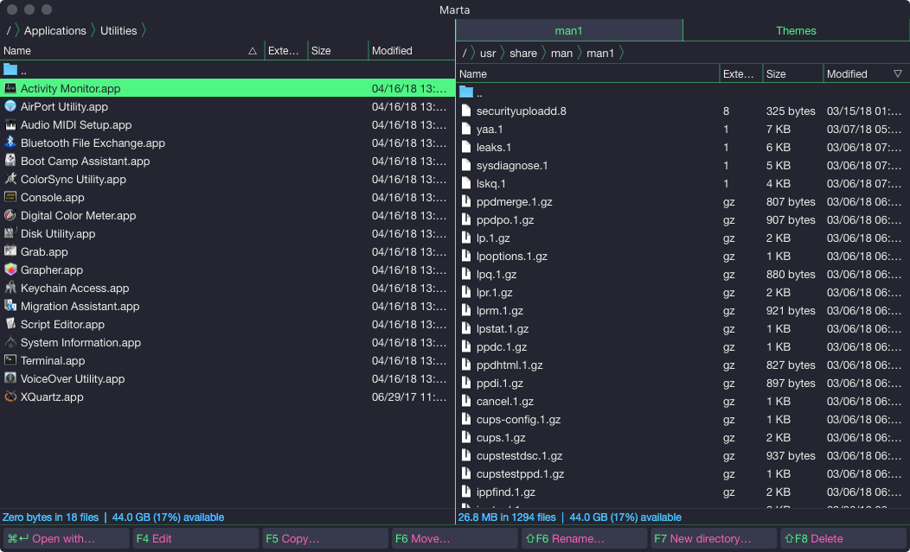

# marta-snazzy
a Snazzy theme interpretation for Marta (https://github.com/sindresorhus/hyper-snazzy)

Marta:
> File Manager for macOS.
> Native. Extensible. Fast

https://marta.yanex.org/

## install

Place the ```Snazzy.theme``` in:

```bash
cd /Applications/Marta.app/Contents/Resources/Themes
```

add 

```json
{
  "behavior": {
        "theme": "Snazzy"
      }
}
```

to the config file located at ```~/Library/Application Support/org.yanex.mart/conf.json```


## What it looks like:


